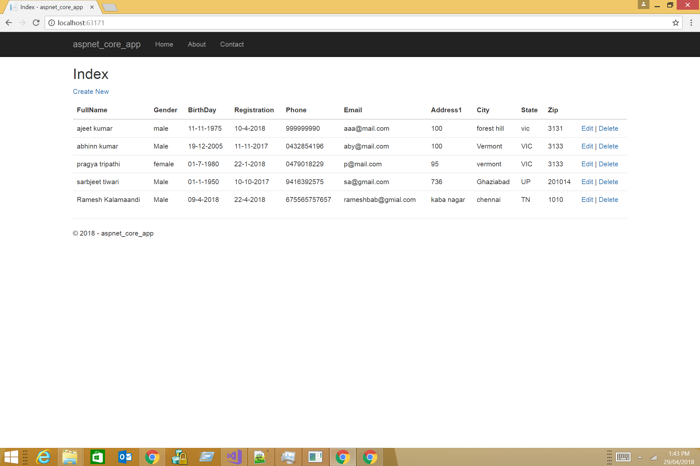

# asp.net core2.0 mvc/api  


 ||
| --- | --- |

[](https://www.microsoft.com/en-au/download/details.aspx?id=1639) |  | 
| ---          | ---        | ---              | 


---------------------------------------

## Introduction 

The repository consists of 2 projects:
1) Asp.Net Core2 MVC 
- Its the frontend through which a user input data and gets output
2) Asp.Net Core2 API 
- Its the backend that processes the request from the MVC frontend

## Features

##### Basic CRUD operation

| Page | Function |
| --- | --- |
| Index | User can view list of existing students |
| Create |  User can create new student |
| Edit | User can edit existing student |
| Delete | User can delete existing student |

#### Index page
```
The list of created students is displayed .
url : / 
```


#### Create student
```
A student can be created
url: /create

```


#### Edit student
```
A student can be edited
url: /edite/{id}

```


#### Delete student
```
A student can be deleted
url: /delete/{id}

```

### Support or Contact

Having any trouble? Check out our [documentation](https://github.com/AJEETX/asp_net_core2/blob/master/README.md) or [contact support](mailto:ajeetkumar@email.com) and we’ll help you sort it out.


[](http://hits.dwyl.io/ajeetx/asp_net_core2/projects/1) | ||
 | --- | --- | ---|
